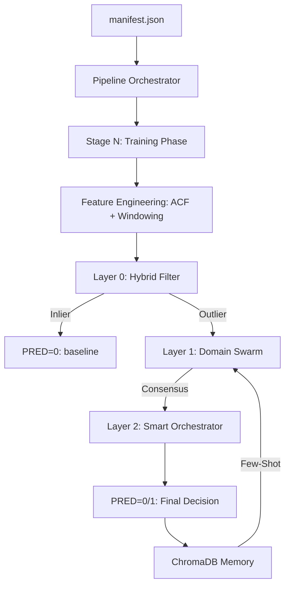

# 🪞 Mirror — Universal Adaptive Multi-Agent Framework

Mirror is a production-grade, domain-agnostic **N-stage multi-agent classification pipeline**. It is designed to solve high-stakes anomaly detection challenges (e.g., healthcare monitoring, financial fraud, industrial predictive maintenance) by marrying **statistical machine learning** with **hierarchical LLM reasoning**.

The framework optimizes for **Agentic Efficiency**, **F1-Score**, and **Economic Value Recovery** through an asymmetric cost-aware decision engine.

---

## 🏛️ Architecture Overview: The 3-Tier Hierarchy

Mirror uses a multi-layered defense-in-depth approach. Each layer filters data, escalating only the most complex cases to the next, more expensive tier.

### Visual Architecture Flow


### Layer Descriptions

#### **Layer 0 — The Sentry (IsolationForest + Nano LLM)**
- **Role**: High-throughput gatekeeper.
- **Mechanism**: Can be configured as `isolation` (Pure ML) or `llm` (Nano-tier LLM).
- **Isolation Forest**: Learned boundary of "Normal Behavior" from training data.
- **Nano Sanity**: In `llm` mode, a low-cost model (GPT-5-Nano) performs a quick triage, dismissing statistical noise and escalating strictly relevant anomalies.

#### **Layer 1 — The Experts (Cheap Domain Swarm)**
- **Role**: Contextual Anti-False-Positive Filter.
- **Mechanism**: Parallel `RoleCoordinator` agents (temporal, spatial, etc.).
- **Swarm Intelligence**: Multiple agents per role reach a `SwarmConsensus` via confidence-weighted voting. Overcomes "stochastic errors" of single LLM calls.

#### **Layer 2 — The Auditor (Smart Orchestrator)**
- **Role**: Final Economic Decision.
- **Mechanism**: Smart-tier LLM (Gemini-3.1-Pro / GPT-4).
- **Function**: Reconciles conflicting swarm verdicts, raw features, and lifestyle context to decide if the cost of an intervention (FN vs FP) is justified.

---

## 🧬 Killer Features: Technical Deep Dive

### 1. ACF Dynamic Window Sizing
Unlike static systems that use fixed rolling windows (e.g., "last 5 days"), Mirror **learns the natural rhythm** of the entity.
- **Autocorrelation (ACF)**: Using `statsmodels`, it identifies the dominant lag (peak autocorrelation).
- **Adaptive Extraction**: If a citizen has a 3-day workout cycle, features are calculated over 3-day windows.
- **Impact**: Removes false alarms caused by natural cyclical fluctuations.

### 2. RAG Warm-Up & Continuous Learning
Mirror implements a **Self-Supervised Memory** strategy:
1. **Fit**: L0 is trained on Class 0 data.
2. **Warm-up**: The system runs a "Sanity Check" on the training set.
3. **Memorization**: Outliers found in the training set are analyzed by L1/L2 and their reasoning is saved to **ChromaDB**.
4. **Few-Shot Retrieval**: During evaluation, L1 agents retrieve these cases to avoid repeating past mistakes.

### 3. Domain Agnosticity
Mirror is **Role-Inferred**. It does not care about the physical meaning of your data.
- **Automatic Scaling**: Describe a role in `manifest.json` (e.g., `"role": "financial"`), and the pipeline will dynamically spawn specialized coordinators without a single line of code change.
- **Universal Prompts**: The reasoning is steered by externalized markdown templates in `prompts/`.

---

## ⚙️ Configuration & Hyperparameters

### Model Tiering
The framework resolves models based on "brain-power" requirements:
- **`nano`**: Extremely cheap, high latency.
- **`cheap`**: Balanced, handles broad context.
- **`smart`**: High reasoning, expensive, used for final ties.

### Key `.env` Variables
| Variable | Default | Purpose |
|----------|---------|---------|
| `LLM_PROVIDER` | `gemini` | `openai` or `gemini`. |
| `L0_ENGINE` | `llm` | `isolation` (Math) or `llm` (Generative). |
| `BYPASS_L0` | `False` | For direct L1/L2 testing (Pure LLM mode). |
| `FN_COST` | `5.0` | Weight of False Negatives (Cost of missing a crisis). |
| `FP_COST` | `1.0` | Weight of False Positives (Cost of unnecessary support). |
| `SWARM_MAX_AGENTS`| `5` | Maximum redundancy per role. |

---

## 📂 Project Structure

- `main.py`: Entry point. Manages logging (`actions.log`, `troubleshooting.log`) and runs.
- `pipeline.py`: The heart. Coordinates N-stages of Fit-Predict.
- `layer0_router.py`: Implements the Hybrid ML/LLM gatekeeper.
- `domain_swarm.py`: Parallel swarm management logic.
- `feature_engineer.py`: Signal processing (ACF, Velocity, Rolling stats).
- `rag_store.py`: ChromaDB abstraction.
- `llm_provider.py`: Multi-tier model factory.
- `prompts/`: Markdown templates. Start here to change domains.

---

## 🚀 Getting Started

### 1. Installation
```bash
python -m venv .venv
source .venv/bin/activate
pip install -r requirements.txt
cp .env.example .env
```

### 2. Run the Challenge
```bash
# Production Run
python main.py -m manifest.json

# Debugging Run (with bypass)
python main.py -m bypass_manifest.json --log-level DEBUG
```

### 3. Evaluating Results
Results are saved per run in `runs/run_TIMESTAMP/results/`:
- `predictions_STAGE.txt`: Submission file.
- `audit_log_STAGE.json`: Deep trace for Langfuse/Analysis.
- `train_audit_log_STAGE.json`: Results of the sanity check.

---

## 🔬 Alternative Execution Modes

| Mode | Configuration | Use Case |
|------|---------------|----------|
| **Standard** | `L0_ENGINE=isolation` | High speed, lowest cost, mathematical baseline. |
| **Hybrid** | `L0_ENGINE=llm` | Better FP rejection at Layer 0. |
| **Cold Start**| `BYPASS_L0=True` | Pure agentic reasoning. No training data required. |

---

License: Challenge submission — Reply Mirror 2026.
Developed for the **Google Deepmind Agentic Challenge**.
